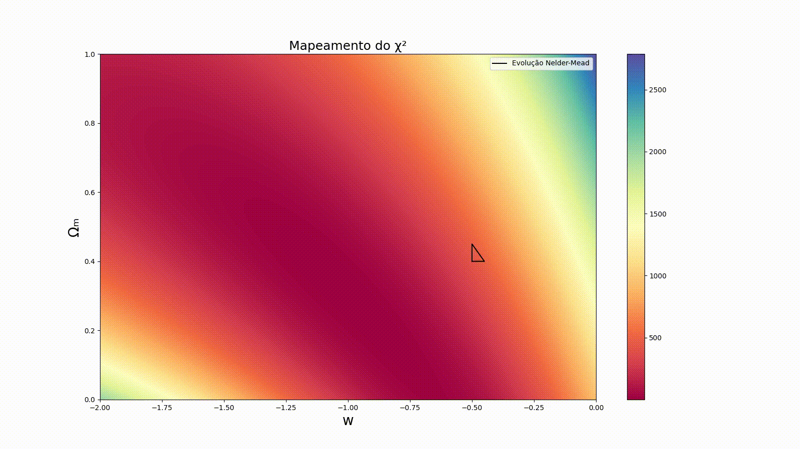
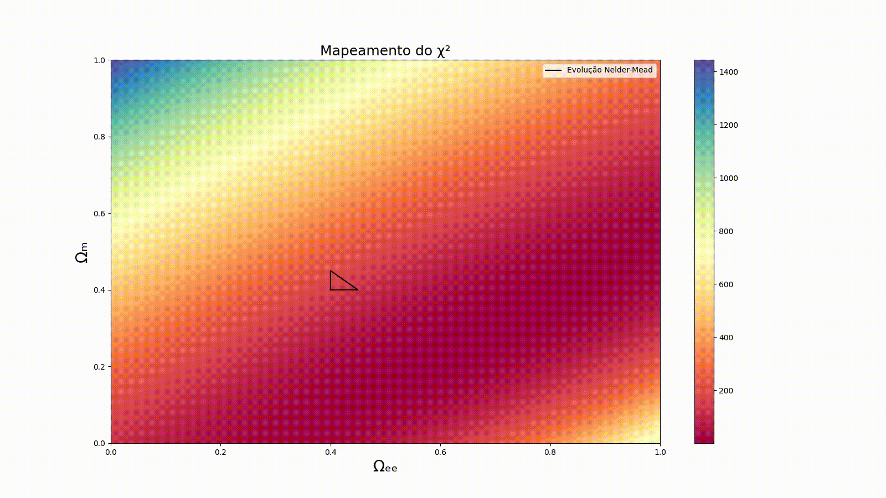

# Minimization of a function with Nelder-Mead Algorithm

Based on cosmological luminosity distance, this program find the best parameters of matter density, dark energy density and w from equation of state.  
It calculates the chi square between a fake dataset and tworetical result of the calculation of the distance modulus.  
The script find the best parameters by applying Nelder-Mead Algorithm on chi square function.  

## Integration using the Trapezoidal method
The C file find the chi square of the cosmological distance modulus, this function includes an integration. The script achieves it by finding the integral result with trapezoidal rule for integration.

## Example 1

## Example 2

## Example 3

